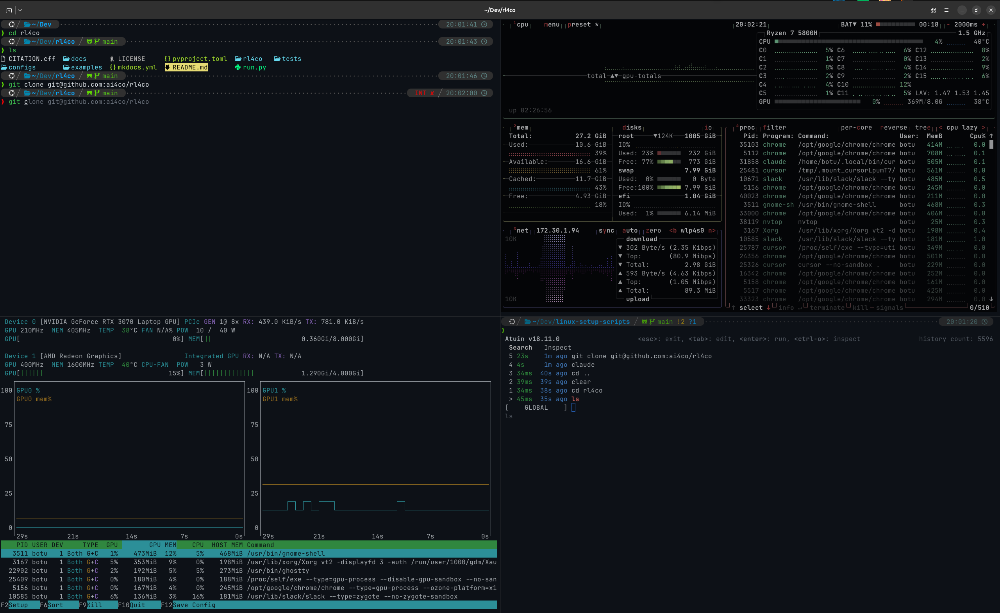

# My Linux Setup

I use Linux (Ubuntu -- and no I don't use Arch btw ;) ) as my daily driver for work and personal use.

This repo contains personal Linux setup scripts and tips  -- stuff that I frequently enough that I thought it might be worth sharing :)

## Ghostty Terminal Emulator

I highly recommend using [Ghostty](https://ghostty.org/) as your terminal emulator. It's a modern, fast, and beautiful terminal emulator for Linux.

I recommend appending these to `~/.config/ghostty/config` :

```toml
########################################################
# CUSTOM 
# from https://github.com/fedebotu/linux-setup
########################################################

# Theme
theme = GitHub Dark Default

# Used for compatibility (e.g. for certain SSH servers)
env = TERM=xterm-256color

# Fix for Ubuntu Linux
async-backend = epoll
```


## Setup with Oh My Zsh and more

This script sets up a complete ZSH environment for **Ubuntu Linux** with useful plugins and modern CLI tools.


**Usage:**

```bash
curl -fsSL https://raw.githubusercontent.com/fedebotu/linux-setup-scripts/main/setup-ohmyzsh | bash
```

**Note:** The script will prompt you to confirm before replacing your `.zshrc` file.


**What it installs:**

1. **ZSH** - The Z shell (via apt)
2. **Oh My Zsh** - ZSH framework with plugins:
   - Git: display current branch, status, commits
   - Autosuggestions: grabbed from history, use right arrow to accept
   - Syntax highlighting: highlights commands as you type
3. **Powerlevel10k** - Beautiful and fast ZSH theme
4. **Modern CLI tools:**
   - [lsd](https://github.com/lsd-rs/lsd) - Better `ls` with colors and icons
   - [vivid](https://github.com/sharkdp/vivid) - LS_COLORS generator for colorful terminal output
   - [atuin](https://github.com/atuinsh/atuin) - Magical shell history (Ctrl+R)

**Features:**

- Downloads a pre-configured `.zshrc` from this repository
- Asks for confirmation before replacing your existing `.zshrc` (backs up to `~/.zshrc.backup`)
- Sets ZSH as your default shell
- All temporary files are downloaded to `/tmp` and cleaned up


Here is how my Ghostty shell looks like after the setup




### Atuin setup

On startup, you can run this to automatically sync your shell history:

```bash
atuin import auto
```

Atuin also has a function to sync the history across devices, although I would rather keep it separate for now.

You may edit the its config in `~/.config/atuin/config.toml` . I mainly changed the `inline_height = 10` for a more compact history display.
